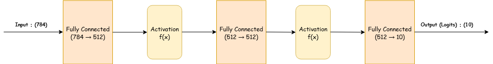

# PolyNeuralNet 

## High Level Description

This repository focuses on training Neural Networks with Learnable Polynomial Activations for degrees 2, 3, 4. 
We train image classifiers on the datasets [Fashion-MNIST](https://github.com/zalandoresearch/fashion-mnist) [1] 
and [CIFAR-10](https://www.cs.toronto.edu/~kriz/cifar.html) [2].

## Architectures

For Shallow Neural Networks, we use the following architecture:
- The MLP consists of an input layer of 784 units (corresponding to the flattened 28×28 Fashion-MNIST image), one hidden layer with 512 units, and an output layer with 10 units producing the class logits. The architecture is illustrated in the diagram below.

## Activation Function

The choice of activation function in the MLP architecture is a central focus of this study. In our case, we compare four different activations:

- Quadratic : $f(x) = ax^2 + bx + c$
- Cubic : $f(x) = ax^3 + bx^2 + cx + d$
- Quartic : $f(x) = ax^4 + bx^3 + cx^2 + dx + e$
- ReLU: $f(x) = \max(0,x)$   [used for benchmark comparisons only]

## Loss Functions

Cross Entropy Loss is the primary loss function used in our Experiment, though we also experiment with MSE (which can be used to create more polynomial-friendly models) in some cases.

## Initializations

In the case of Polynomial Activations, we initialze each polynomial to $f(x) = αx$ for some non-zero parameter $α$.  Essentially, the polynomials are initialized to linear functions, and the non-linearity, derived from the higher-order term coefficients and constant term, are learned during training. We also use Xavier Initialization of the weights, multiplied by scaling factor $1/α$ to maintain variance across forward and backward passes.
In the Case of ReLU, we use Standard He initialization for the weights.

For experimentation, we use a total of 9 different runs involving degree/α pair combinations:

| Degree | α    |
|--------|------|
| 2      | 0.90 |
| 2      | 1.00 |
| 2      | 1.10 |
| 3      | 0.90 |
| 3      | 1.00 |
| 3      | 1.10 |
| 4      | 0.90 |
| 4      | 1.00 |
| 4      | 1.10 |

We include a 10th run with using (fixed) ReLU. 

## Optimization

In each run, we use Stochastic Gradient Descent (SGD) + Cosine Annealing with the following extra/hyper parameters:

Batch Size: 128 
Initial Learning Rate: 0.1
Number of Epochs: 30
Momentum: 0.9
Weight decay: 1e-4

## Miscellaneous

To control the risk of exploding gradients—particularly when using higher-degree polynomial activations—and to ensure fair comparison with ReLU baselines, we apply gradient clipping with a maximum norm of 1.0 when necessary.

Given the shallow nature of the MLP architecture, we additionally report whether and when training instabilities (e.g., NaNs) occur without clipping. This allows us to provide direct comparisons of mean accuracies with and without gradient clipping.

As the experiments are extended to deeper architectures, gradient clipping is treated as a standard component of the training setup, even for lower-degree polynomials. Nevertheless, we note that higher-degree polynomials may still exhibit occasional instabilities despite clipping.

## Experiment

We repeat each experiment with 12 i.i.d randomly seeds. For every setting, we report the mean accuracy along with confidence intervals, providing an estimate of the true expected performance. 

Deliverables:

[3x3 Table with Degree / α, reporting the 9 different setups]
[Result for ReLU Mean Accuracy]
[Graphs showing the per-epoch accuracy of all 9 runs]. We only need to store per-trial: (Epoch, Mean Accuracy).  3 graphs should be included, one for each alpha parameter. In the graphs, we should have exactly four plots (Degree 2, 3, 4, and ReLU).

## Sources

[1] Han Xiao, Kashif Rasul, and Roland Vollgraf. *Fashion-MNIST: a Novel Image Dataset for Benchmarking Machine Learning Algorithms.* arXiv:1708.07747 [cs.LG], 2017.  
[2] Alex Krizhevsky. *Learning Multiple Layers of Features from Tiny Images.* Technical Report, University of Toronto, 2009.
